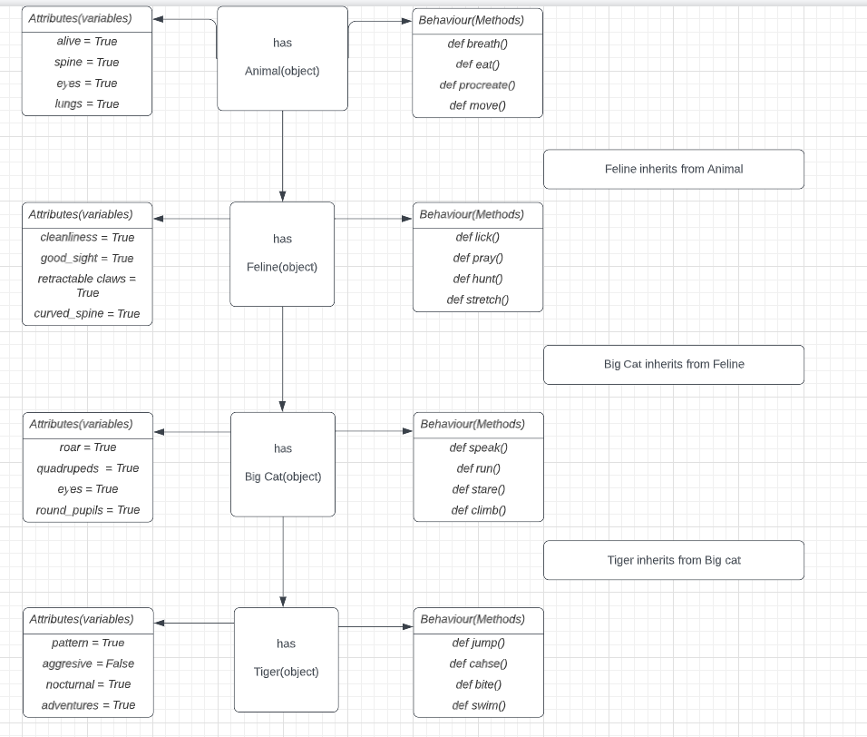

# OOP Four Pillars
Object-oriented programming (OOP) in Python is a programming paradigm that uses objects and classes to organize code. It is a style of programming that focuses on creating objects, which contain data and methods, and using these objects to design applications and computer programs. OOP is a powerful programming technique that allows developers to create complex applications quickly and easily.

In Python, classes are used to create objects, which are then used to store data and methods. Objects are instances of classes, and can be used to access and manipulate data. Classes can also be used to create objects that are related to each other, allowing developers to create complex applications with ease.
# Four pillars of OOP
- Abstraction - Abstraction in Python is the process of hiding the implementation details of a program from the user. It is a way of simplifying complex systems by hiding the underlying details and focusing on the essential features. (e.g. Most people don know many things about cars like how the engine works or how the gear box works, however they are still able to drive)

- Inheritance - Inheritance in Python is a way of creating a new class (called a child class) from an existing class (called a parent class). The child class inherits all the attributes and methods of the parent class, allowing it to use and modify them.Inheritance is a powerful feature of object-oriented programming (OOP) that allows developers to create new classes that share some of the same characteristics of existing classes. This allows developers to create new classes that are more specialized and can be used in different situations. Additionally, inheritance allows for code to be reused and modified in different ways, making it easier to maintain and debug code.


- Encapsulation - Encapsulation in Python is a process of wrapping code and data together into a single unit. It is a way of restricting access to methods and variables. This prevents data from being directly modified which can lead to security and structural problems. Encapsulation in Python can be achieved by using classes. By using classes, the data is kept private and secure and can only be accessed through the class’s methods.


- Polymorphism - Polymorphism in Python is the ability of an object to take on multiple forms. This is especially useful when dealing with inheritance, as it allows subclasses to share the same interface as their parent class, while still providing specific functionality. Polymorphism is a powerful concept in object-oriented programming, as it allows for code reuse and extensibility. It also allows for more efficient code, as it eliminates the need for multiple functions to handle different types of data.



# Abstraction
```python
class Animal:

    def __init__(self):
        self.alive = True
        self.spine = True
        self.eyes = True
        self.lungs = True

    def breath(self):
        print("One breath in one breath out")

    def eat(self):
        print("Nom Nom Nom")

    def procreate(self):
        print("Find a mate")

    def move(self):
        print("Onwards and Upwards")

cat = Animal()
cat.breath()
```
This code creates an `Anima`l class and then creates an instance of the class called cat. The `Animal` class has four methods: `breath`, `eat`, `procreate`, and `move`. The code then calls the `breath` method on the cat instance, which will print out the string `One breath in one breath out`. Therefore, this code creates an Animal class and then calls the breath method on the cat instance, which will print out a string.

# Inheritance 
```python
from animal import Animal

class Reptile(Animal):

    def __init__(self):
        super().__init__()      # important
        self.cold_blooded = True
        self.tetrapod = None # Not all reptiles are tetrapods..
        self.heart_chambers = [3, 4]
        self.amniotic_eggs = None

    def seek_heat(self):
        print("It's cold outside, where is the sun?")

    def hunt(self):
        print("Wait, wait, wait ... Pounce")

    def use_venom(self):
        print("Squirt")

    def attract_through_scent(self):
        print("Time to spray perfume")

jeremy_the_reptile = Reptile()
```
This code creates an instance of the `Reptile` class, which is a subclass of the `Animal` class. The `Reptile` class has several attributes, such as `cold_blooded`, `tetrapod`, `heart_chambers`, and `amniotic_eggs`. It also has several methods, `such as seek_heat`, `hunt, use_venom`, and `attract_through_scent`. 

The code then creates an instance of the `Reptile` class, called `jeremy_the_reptile`, and calls several of its methods. The `seek_heat method` prints a message about looking for the sun, the `hunt` method prints a message about waiting and pouncing, the `use_venom` method prints a message about squirting, and the `attract_through_scent` method prints a message about spraying perfume. 

In summary, this code creates an instance of the `Reptile` class and calls several of its methods to print messages.

# Encapsulation
```python
from reptile import Reptile

class Snake(Reptile):
    def __init__(self):
        super().__init__()
        self.forked_tongue = True
        self.cold_blooded = True
        self.venom = None
        self.limbs = False

    def use_tongue_to_smell(self):
        print("Do I say it smells or tastes nice")

sidney = Snake()
sidney.seek_heat()
```
This code creates an instance of the `Snake` class which is a subclass of the `Reptile` class. The Snake class has four attributes: `forked_tongue`, `cold_blooded`, `venom`, and `limbs`. The method sets the values of these attributes to `True`, `None`, and `False` respectively. The `use_tongue_to_smell` method prints a question. Finally, the code creates an instance of the `Snake` class called sidney and calls the `seek_heat` method on it. The `seek_heat method` is inherited from the `Reptile` class and will print `"It's cold outside, where is the sun?"` from the parent class.

# Polymorphism
```python
from snake import Snake

class Python(Snake):

    def __init__(self):
        super(). __init__()

        self.large = True
        self.two_lungs = True
        self.venom = False

    def digest_large_prey(self):
        print("Gulp")

    def constrict(self):
        print("squeeze")

    def climb(self):
        print("Up we go")

    def shed_skim(self):
        print(" I'm growing out of this now")

peter = Python()
peter.breath()
peter.use_tongue_to_smell()
```

This code creates a new instance of the `Python` class, which is a subclass of the `Snake` class. The `Python` class has several methods that are specific to Python snakes, such as `digest_large_prey`, `constric`t, `climb`, and `shed_skin`. The code then creates an instance of the `Python` class, which is assigned to the variable `peter`. Finally, the code calls two methods on the peter object, `breath` and `use_tongue_to_smell`. The breath method is inherited from the Snake class, and the use_tongue_to_smell method is also inherited from the Snake class. This code demonstrates how to create a subclass of an existing class, and how to call methods on an instance of the subclass.

# Benefits of OOP

One of the main advantages of OOP in Python is its ability to model real-world objects and their interactions. OOP allows developers to create objects that represent real-world entities, such as cars, people, and animals. This makes it easier to understand and manipulate data, as the objects can be manipulated in the same way as their real-world counterparts. 

Another benefit of OOP in Python is its ability to encapsulate data. This means that data can be stored within an object and accessed only through the object’s methods. This helps to ensure data integrity, as data is not accessible to external sources. 

OOP also makes it easier to maintain and modify code. Since objects are self-contained, it is easier to make changes to a single object without affecting the rest of the code. This makes it easier to debug and test code. 

Finally, OOP makes it easier to create reusable code. Since objects are self-contained, they can be reused in other projects. This makes it easier to create code that can be used in multiple projects, saving time and effort. 

Overall, OOP in Python provides a number of benefits over other programming paradigms. It makes it easier to model real-world objects and their interactions, encapsulate data, maintain and modify code, and create reusable code.
